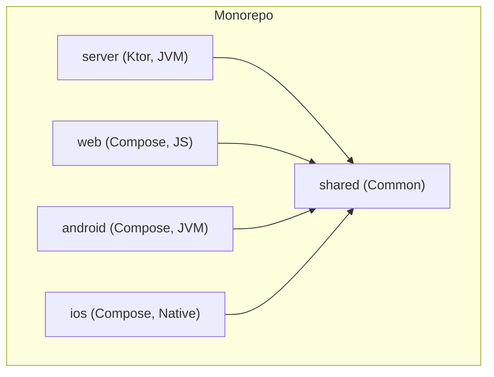

# My Groceries Architecture Document

## 1. Introduction

This document outlines the overall project architecture for My Groceries, including backend systems, shared services, and non-UI specific concerns. Its primary goal is to serve as the guiding architectural blueprint for AI-driven development, ensuring consistency and adherence to chosen patterns and technologies.

**Relationship to Frontend Architecture:**
This project includes a significant user interface, detailed in a separate [Frontend UI/UX Specification](./front-end-spec.md). That document MUST be used in conjunction with this one. Core technology stack choices documented herein (see "Tech Stack") are definitive for the entire project, including all frontend components.

### 1.1. Starter Template or Existing Project

N/A. This is a greenfield project that will be built from scratch following the standard Kotlin Multiplatform project structure. No starter templates will be used.

### 1.2. Change Log

| Date | Version | Description | Author |
| :--- | :--- | :--- | :--- |
| 2025-10-18 | 1.0 | Initial architecture based on PRD v1.0. | Winston (Architect) |

## 2. High Level Architecture

### 2.1. Technical Summary

The architecture for "My Groceries" is a **local-first monolithic system** designed for simplicity and user privacy, aligning with the PRD's core goals. The system is built entirely within a **Kotlin Multiplatform monorepo**, enabling maximum code sharing between the backend and the cross-platform clients (Web, Android, iOS). A local **Ktor server** will manage business logic and API endpoints, communicating with a local **PostgreSQL database** for data persistence. The UI will be delivered by **Compose for Multiplatform**. This pragmatic approach ensures rapid development for the MVP while establishing a solid foundation for future enhancements like a hosted version.

### 2.2. High Level Overview

*   **Architectural Style:** Monolith. A single, locally-run application process contains both the backend server and serves the client application. This is ideal for the MVP's local-first requirement (NFR1).
*   **Repository Structure:** Monorepo. This aligns with the standard KMP project structure and simplifies dependency management and code sharing across server and client modules (as per PRD Technical Assumptions).
*   **Primary Data Flow:** The user interacts with **shared UI components (Composables)** located in the `shared` module. UI actions are handled by shared **ViewModels**, also in the `shared` module. These ViewModels call a shared API client, which communicates with the local Ktor server via HTTP. The server processes requests and returns data. The ViewModels update the UI state, which is observed by the shared UI components for rendering. The platform-specific modules (`android`, `ios`, `web`) act as thin wrappers that host this shared UI.
*   **Key Rationale:** This architecture prioritizes user data privacy and control by keeping all components on the user's machine. The use of KMP minimizes redundant code and ensures a consistent technology stack across all layers of the application.

### 2.3. High Level Project Diagram

```mermaid
graph TD
    User[User]
    subgraph User's Local Machine
        subgraph "My Groceries Application"
            subgraph "Platform-Specific Client Shells"
                UI_Web[Web Shell (JS)]
                UI_Android[Android Shell (JVM)]
                UI_iOS[iOS Shell (Native)]
            end

            Shared_Code[Shared KMP Module <br/> (UI Components, ViewModels, Data Models, API Client)]

            subgraph "Local Server (Ktor)"
                API[REST API Endpoints] --> Logic[Business Logic/Services]
            end
            DB[(PostgreSQL Database)]
        end
    end
    
    User --> UI_Web
    User --> UI_Android
    User --> UI_iOS

    UI_Web & UI_Android & UI_iOS --> Shared_Code
    Shared_Code --> API
    Logic --> DB
```

### 2.4. Architectural and Design Patterns

*   **Repository Pattern:** Data access logic will be abstracted behind a repository layer within the server. This decouples the business logic from the database implementation, enabling easier testing (with mocks) and future flexibility if the data store were to change.
*   **Dependency Injection (DI):** A DI framework (like Koin or manual injection) will be used on the server to manage dependencies between services, repositories, and controllers. This promotes loose coupling and testability.
*   **Model-View-ViewModel (MVVM) with Shared UI:** The application will adopt the MVVM pattern. **ViewModels and UI components (Composables/Views) will be implemented in the `shared` module** to maximize code reuse. These shared ViewModels will contain the UI state and business logic, interacting with the API client to fetch data and exposing state to the shared composable UI.
*   **RESTful API:** Communication between the client and server will be via a RESTful API. This is a standard, well-understood pattern for client-server communication.

## 3. Tech Stack

### 3.1. Cloud Infrastructure

*   **Provider:** N/A for MVP. The application is local-first.
*   **Key Services:** N/A
*   **Deployment Regions:** N/A

### 3.2. Technology Stack Table

| Category | Technology | Version | Purpose | Rationale |
| :--- | :--- | :--- | :--- | :--- |
| **Language** | Kotlin | 1.9.23 | Primary language for all code | Required for KMP, modern, and type-safe. |
| **Core Framework** | Kotlin Multiplatform | 1.6.10 | Enables code sharing | A core non-functional requirement (NFR2). |
| **UI Framework** | Compose Multiplatform | 1.6.1 | UI for Web, Android, iOS | A core non-functional requirement (NFR3). |
| **Backend Framework** | Ktor | 2.3.9 | Local server and client HTTP | Lightweight, idiomatic Kotlin, and well-integrated with KMP. |
| **Database** | PostgreSQL | 15.x | Local data persistence | A core non-functional requirement (NFR5). |
| **Database Driver** | Exposed | 0.49.0 | SQL framework for Kotlin | Provides a type-safe DSL for interacting with PostgreSQL. |
| **Serialization** | Kotlinx Serialization | 1.6.3 | JSON handling | Native Kotlin library for serializing data models for the API. |
| **Testing** | Kotest | 5.8.1 | Unit and integration testing | Provides a flexible and powerful testing framework for Kotlin. |
| **Testing** | MockK | 1.13.10 | Mocking library for tests | Simplifies mocking dependencies in unit tests. |

## 4. Data Models

The following conceptual models are derived from the PRD (FR1, FR2, FR3). They will be implemented as `@Serializable` data classes in the `shared` module.

### 4.1. Category

*   **Purpose:** Represents a category for grocery products (e.g., "Dairy", "Produce").
*   **Key Attributes:**
    *   `id`: UUID - Unique identifier.
    *   `name`: String - The name of the category.
*   **Relationships:**
    *   One-to-Many: A `Category` can have many `Products`.

### 4.2. Product

*   **Purpose:** Represents a specific grocery product (e.g., "Milk", "Apples").
*   **Key Attributes:**
    *   `id`: UUID - Unique identifier.
    *   `name`: String - The name of the product.
    *   `categoryId`: UUID - Foreign key linking to the `Category`.
*   **Relationships:**
    *   Many-to-One: A `Product` belongs to one `Category`.
    *   Many-to-Many: A `Product` can be in many `Orders` (via `LineItem`).

### 4.3. Order

*   **Purpose:** Represents a single shopping trip or transaction.
*   **Key Attributes:**
    *   `id`: UUID - Unique identifier.
    *   `date`: Instant - The date and time of the order.
    *   `totalCost`: BigDecimal - The total cost of the order.
*   **Relationships:**
    *   One-to-Many: An `Order` can have many `LineItems`.

### 4.4. LineItem

*   **Purpose:** A join-table entity linking a `Product` to an `Order`, representing a single item purchased in that order.
*   **Key Attributes:**
    *   `id`: UUID - Unique identifier.
    *   `orderId`: UUID - Foreign key linking to the `Order`.
    *   `productId`: UUID - Foreign key linking to the `Product`.
    *   `cost`: BigDecimal - The cost of this item in this specific order.
    *   `quantity`: Double - The quantity of the product purchased.
*   **Relationships:**
    *   Many-to-One: A `LineItem` belongs to one `Order`.
    *   Many-to-One: A `LineItem` refers to one `Product`.

## 5. Components

### 5.1. Component List

#### `shared` Module
*   **Responsibility:** Contains all code shared between the client and server. This includes data models (`Category`, `Product`, etc.), API client interfaces, and potentially shared validation logic.
*   **Key Interfaces:** Data classes, API client interface, ViewModels, UI Components (Composables).
*   **Dependencies:** Kotlinx Serialization, Ktor Client, Compose Multiplatform.
*   **Technology Stack:** Kotlin Common.

#### `server` Module
*   **Responsibility:** The Ktor-based backend. It handles all business logic, API endpoint routing, database interaction, and serving the web client.
*   **Key Interfaces:** REST API endpoints (`/categories`, `/products`, `/orders`).
*   **Dependencies:** `shared` module, Ktor Server, Exposed (DB driver), PostgreSQL.
*   **Technology Stack:** Kotlin/JVM.

#### `client` (Conceptual: `web`, `android`, `ios` modules)
*   **Responsibility:** The platform-specific entry point. It is responsible for setting up the application window/environment and hosting the shared UI from the `shared` module. It contains minimal platform-specific code.
*   **Key Interfaces:** User Interface (screens, components).
*   **Dependencies:** `shared` module, Compose for Multiplatform.
*   **Technology Stack:** Kotlin/JS (Web), Kotlin/JVM (Android), Kotlin/Native (iOS).

### 5.2. Component Diagram



## 6. REST API Spec

The following OpenAPI 3.0 specification outlines the API contract required by the PRD. This will be implemented in the `server` module.

```yaml
openapi: 3.0.3
info:
  title: My Groceries API
  version: 1.0.0
  description: API for managing grocery spending data.
servers:
  - url: http://localhost:8080
    description: Local Development Server
paths:
  /categories:
    get:
      summary: Retrieve all categories, with optional sorting by spend.
      parameters:
        - name: sortBy
          in: query
          schema:
            type: string
            example: "spend:desc"
      responses:
        '200':
          description: A list of categories.
    post:
      summary: Create a new category.
      responses:
        '201':
          description: Category created.
  /categories/{id}:
    get:
      summary: Retrieve a single category by ID.
    put:
      summary: Update an existing category.
    delete:
      summary: Delete a category.
  /products:
    get:
      summary: Retrieve products, with optional filtering and sorting.
      parameters:
        - name: categoryId
          in: query
          schema:
            type: string
            format: uuid
        - name: sortBy
          in: query
          schema:
            type: string
            example: "spend:desc"
      responses:
        '200':
          description: A list of products.
    post:
      summary: Create a new product.
  /products/{id}:
    get:
      summary: Retrieve a single product by ID.
    put:
      summary: Update an existing product.
    delete:
      summary: Delete a product.
  /orders:
    get:
      summary: Retrieve orders, with optional filtering.
      parameters:
        - name: categoryId
          in: query
          schema:
            type: string
            format: uuid
        - name: productId
          in: query
          schema:
            type: string
            format: uuid
      responses:
        '200':
          description: A list of orders.
    post:
      summary: Create a new order with its line items.
  /orders/{id}:
    get:
      summary: Retrieve a single order by ID.
    put:
      summary: Update an order's top-level details.
    delete:
      summary: Delete an order and its line items.
  /health:
    get:
      summary: Health check endpoint.
      responses:
        '200':
          description: Server is healthy.
```

## 7. Database Schema

The following SQL DDL defines the schema for the PostgreSQL database. This will be managed via migration files within the `server` module (Story 1.2).

```sql
CREATE EXTENSION IF NOT EXISTS "uuid-ossp";

CREATE TABLE categories (
    id UUID PRIMARY KEY DEFAULT uuid_generate_v4(),
    name VARCHAR(255) NOT NULL UNIQUE
);

CREATE TABLE products (
    id UUID PRIMARY KEY DEFAULT uuid_generate_v4(),
    name VARCHAR(255) NOT NULL,
    category_id UUID NOT NULL,
    FOREIGN KEY (category_id) REFERENCES categories(id) ON DELETE CASCADE
);

CREATE TABLE orders (
    id UUID PRIMARY KEY DEFAULT uuid_generate_v4(),
    order_date TIMESTAMPTZ NOT NULL,
    total_cost NUMERIC(10, 2) NOT NULL
);

CREATE TABLE line_items (
    id UUID PRIMARY KEY DEFAULT uuid_generate_v4(),
    order_id UUID NOT NULL,
    product_id UUID NOT NULL,
    cost NUMERIC(10, 2) NOT NULL,
    quantity DOUBLE PRECISION NOT NULL,
    FOREIGN KEY (order_id) REFERENCES orders(id) ON DELETE CASCADE,
    FOREIGN KEY (product_id) REFERENCES products(id) ON DELETE CASCADE
);

-- Indexes for performance
CREATE INDEX idx_products_category_id ON products(category_id);
CREATE INDEX idx_line_items_order_id ON line_items(order_id);
CREATE INDEX idx_line_items_product_id ON line_items(product_id);
```

## 8. Source Tree

The project will follow the standard Kotlin Multiplatform directory structure.

```plaintext
my-groceries/
├── .bmad-core/               # BMAD agent configurations
├── build.gradle.kts          # Root build file
├── settings.gradle.kts       # Project settings
├── gradle/
├── docs/
│   ├── prd.md
│   ├── architecture.md       # This document
│   └── front-end-spec.md
│
├── shared/                   # Shared KMP module (common code)
│   ├── src/
│   │   ├── commonMain/
│   │   │   └── kotlin/
│   │   │       └── com/example/mygroceries/
│   │   │           ├── model/          # Data classes (Category, Product, etc.)
│   │   │           ├── remote/         # Ktor HTTP client and API service
│   │   │           └── presentation/   # Shared UI logic and components
│   │   │               ├── viewmodel/  # Shared ViewModels for UI state
│   │   │               └── ui/         # Shared Composables (screens, components)
│   │   ├── androidMain/
│   │   ├── iosMain/
│   │   └── jvmMain/
│
├── server/                   # Ktor backend module
│   ├── src/
│   │   └── main/
│   │       ├── kotlin/
│   │       │   └── com/example/mygroceries/
│   │       │       ├── Application.kt  # Ktor server entry point
│   │       │       ├── plugins/        # Ktor plugin configs (Serialization, Routing)
│   │       │       ├── db/             # Database connection, migrations, repositories
│   │       │       └── routes/         # API route definitions
│   │       └── resources/
│   │           ├── application.conf    # Ktor configuration
│   │           └── db/migration/       # SQL migration files
│
├── web/                      # Web client module (Compose for Web)
│   └── src/
│       └── jsMain/
│           └── kotlin/
│
├── android/                  # Android client module
│   └── src/
│       └── main/
│           └── java/
│
└── ios/                      # iOS client module
    └── src/
        └── main/
            └── kotlin/
```

## 9. Test Strategy and Standards

As per the PRD, the project will include both unit and integration tests.

*   **Unit Tests:**
    *   **Scope:** Individual functions, services, and composables in isolation.
    *   **Location:** Within each module's `commonTest` or `test` source set.
    *   **Tools:** Kotest for assertions, MockK for mocking dependencies (e.g., mocking repository layer in service tests).
    *   **Requirement:** All business logic in the `server` module and `ViewModel` logic in client modules must be covered by unit tests.

*   **Integration Tests:**
    *   **Scope:** Verify the interactions between components, primarily focusing on the API endpoints.
    *   **Location:** Within the `server` module's `test` source set.
    *   **Approach:** Tests will spin up an in-memory or Testcontainers instance of the Ktor application and make real HTTP requests to the endpoints, asserting the responses and database state changes.
    *   **Requirement:** All API endpoints defined in Epic 1 must have corresponding integration tests.

## 10. Security

For the MVP, security considerations are minimal due to the local-first nature of the application.

*   **Data at Rest:** Data is stored in a local PostgreSQL database on the user's machine. The security of this data is dependent on the user's own machine security. No encryption at rest will be implemented for the MVP.
*   **Data in Transit:** Communication is between a local client and a local server. While unencrypted HTTP is acceptable for this loopback communication, all external network traffic (if any is added in the future) MUST use HTTPS.
*   **Input Validation:** The server MUST perform validation on all incoming API request data to ensure data integrity and prevent issues like SQL injection (though mitigated by using a framework like Exposed). This is specified in the Acceptance Criteria for the API stories.
*   **Secrets Management:** N/A for MVP, as there are no external services requiring API keys.

## 11. Next Steps

This architecture document provides the technical blueprint for the "My Groceries" application. The next step is for the development team to begin implementation, starting with Epic 1.

### Developer Handoff Prompt

Please begin development of the 'My Groceries' application. Refer to the PRD and this Architecture Document. Start with **Story 1.1: Project Scaffolding & Dependencies** to establish the Kotlin Multiplatform project structure as defined in the `Source Tree` section of the architecture. Ensure all technology versions match the `Tech Stack` table.
