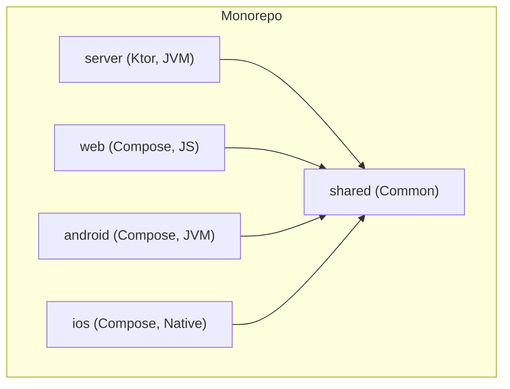

# 5. Components

### 5.1. Component List

#### `shared` Module
*   **Responsibility:** Contains all code shared between the client and server. This includes data models (`Category`, `Product`, etc.), API client interfaces, and potentially shared validation logic.
*   **Key Interfaces:** Data classes, API client interface, ViewModels, UI Components (Composables).
*   **Dependencies:** Kotlinx Serialization, Ktor Client, Compose Multiplatform.
*   **Technology Stack:** Kotlin Common.

#### `server` Module
*   **Responsibility:** The Ktor-based backend. It handles all business logic, API endpoint routing, database interaction, and serving the web client.
*   **Key Interfaces:** REST API endpoints (`/categories`, `/products`, `/orders`).
*   **Dependencies:** `shared` module, Ktor Server, Exposed (DB driver), PostgreSQL.
*   **Technology Stack:** Kotlin/JVM.

#### `client` (Conceptual: `web`, `android`, `ios` modules)
*   **Responsibility:** The platform-specific entry point. It is responsible for setting up the application window/environment and hosting the shared UI from the `shared` module. It contains minimal platform-specific code.
*   **Key Interfaces:** User Interface (screens, components).
*   **Dependencies:** `shared` module, Compose for Multiplatform.
*   **Technology Stack:** Kotlin/JS (Web), Kotlin/JVM (Android), Kotlin/Native (iOS).

### 5.2. Component Diagram

