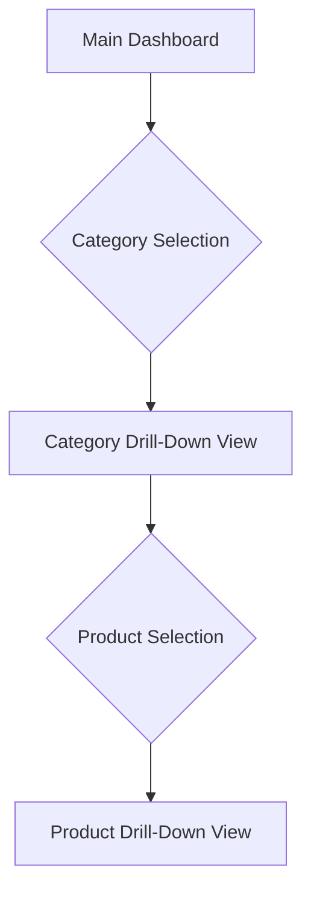
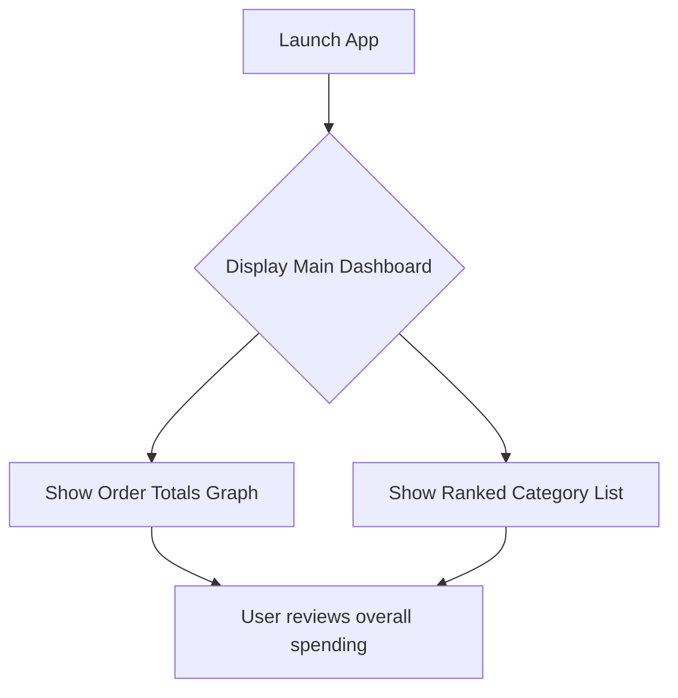
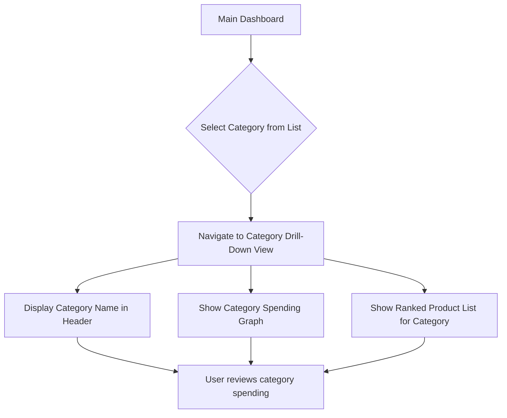
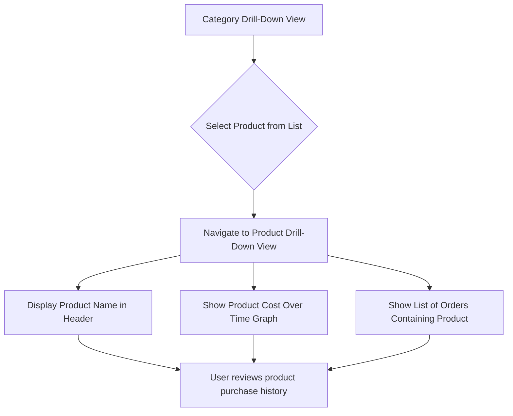

# My Groceries UI/UX Specification

## 1. Introduction

This document defines the user experience goals, information architecture, user flows, and visual design specifications for My Groceries's user interface. It serves as the foundation for visual design and frontend development, ensuring a cohesive and user-centered experience.

### 1.1. Overall UX Goals & Principles

##### Target User Personas
*   **The Data-Driven Home Cook:** An individual who is budget-conscious and wants to understand their grocery spending habits in detail. They are comfortable with technology and appreciate clear, actionable data visualizations. They are motivated to find savings and optimize their shopping.

##### Usability Goals
*   **Rapid Insight:** Users can identify their top 3 spending categories in under 60 seconds from launching the application.
*   **Effortless Navigation:** Users can drill down from the main dashboard to a specific product's history in no more than 3 clicks.
*   **High Learnability:** A new user can understand and use the application's core features without any tutorial or instructions.

##### Design Principles
1.  **Clarity First:** Prioritize clear, unambiguous data presentation. The meaning of every chart and number should be immediately obvious.
2.  **Insight over Information:** Don't just show data; provide insights. Visualizations should guide the user toward meaningful conclusions about their spending.
3.  **Seamless Drill-Down:** The transition from a high-level overview to granular detail should feel natural and instantaneous.
4.  **Material You:** Fully embrace the principles of Material Design, using its components and patterns to create a modern, trustworthy, and platform-native feel.

## 2. Information Architecture (IA)

#### 2.1. Site Map / Screen Inventory

#### 2.2. Navigation Structure

**Primary Navigation:** The main entry point is the Dashboard, from which all other views are accessed via drill-down. No explicit global primary navigation bar is planned for the MVP.

**Secondary Navigation:** Contextual navigation elements (e.g., back buttons, filters within views) will facilitate movement within specific sections.

**Breadcrumb Strategy:** A clear breadcrumb trail will be implemented to show the user's current location and allow easy navigation back up the hierarchy (e.g., `Dashboard > [Category Name] > [Product Name]`).

## 3. User Flows

#### 3.1. View Overall Spending (Main Dashboard)

**User Goal:** To quickly see their overall grocery spending trends and top categories.

**Entry Points:** Application launch.

**Success Criteria:** User sees a graph of order totals over time and a ranked list of categories by spend.

##### Flow Diagram

##### Edge Cases & Error Handling:
- If no data is available, display a clear message indicating no spending data and prompt for data import (future feature).
- If API calls fail, display a user-friendly error message and a retry option.

##### Notes:
This is the initial view of the application, designed for immediate insight.

#### 3.2. Drill Down into a Category

**User Goal:** To understand spending within a specific grocery category.

**Entry Points:** Selecting a category from the Main Dashboard.

**Success Criteria:** User sees a graph of spending for that category over time and a ranked list of products within it.

##### Flow Diagram

##### Edge Cases & Error Handling:
- If the selected category has no associated spending data, display a message indicating no data for this category.
- If API calls for category data or products fail, display a user-friendly error message and a retry option.

##### Notes:
This flow enables users to explore specific areas of their spending in more detail, directly supporting the drill-down navigation paradigm.

#### 3.3. Drill Down into a Product

**User Goal:** To see the purchase history and cost trend for a specific product.

**Entry Points:** Selecting a product from the Category Drill-Down View.

**Success Criteria:** User sees a graph of the product's cost over time and a list of orders containing that product.

##### Flow Diagram

##### Edge Cases & Error Handling:
- If the selected product has no associated order data (e.g., an error occurred during data ingestion), display a message indicating no purchase history.
- If API calls for product order data fail, display a user-friendly error message and a retry option.

##### Notes:
This flow provides the most granular level of detail, allowing users to track individual product spending over time.

## 4. Wireframes & Mockups

#### 4.1. Design Files

**Primary Design Files:** For the MVP, detailed high-fidelity mockups in external tools like Figma or Sketch are not strictly required due to the direct implementation with Compose for Multiplatform and Material Design. The source code itself, adhering to Material Design guidelines, will serve as the primary design artifact. Any conceptual wireframes will be low-fidelity and can be created using simple sketching tools or basic digital wireframing software.

#### 4.2. Key Screen Layouts

##### 4.2.1. Main Dashboard

**Purpose:** Provide an at-a-glance overview of grocery spending trends and top categories.

**Key Elements:**
- Top App Bar with "My Groceries" title.
- Graph of individual order totals over time.
- List of categories ranked by total spend, with each item being selectable. Each item will display the category name, total cost, and a visual representation (e.g., a bar or background gradient) indicating its percentage of the total spending across all categories. The visual representation will use a gradient from dark to light based on the percentage.
- Loading indicators for data fetching.
- Error messages for data loading failures.

**Interaction Notes:** Tapping a category in the list navigates to the Category Drill-Down View.

**Design File Reference:** (To be created as low-fidelity wireframes or sketches if needed for alignment)

##### 4.2.2. Category Drill-Down View

**Purpose:** Display detailed spending information for a selected grocery category.

**Key Elements:**
- Top App Bar with category name and a back button.
- Graph showing total spend for the category over time.
- List of products within the category, ranked by total spend, with each item being selectable. Each item will display the product name, total cost, and a visual representation (e.g., a bar or background gradient) indicating its percentage of the total spending within that category. The visual representation will use a gradient from dark to light based on the percentage.
- Loading indicators for data fetching.
- Error messages for data loading failures.

**Interaction Notes:** Tapping a product in the list navigates to the Product Drill-Down View. Tapping the back button returns to the Main Dashboard.

**Design File Reference:** (To be created as low-fidelity wireframes or sketches if needed for alignment)

##### 4.2.3. Product Drill-Down View

**Purpose:** Show the purchase history and cost trend for a specific product.

**Key Elements:**
- Top App Bar with product name and a back button.
- Graph showing the cost of the product in each order over time.
- List of all orders in which the product was purchased, showing date, quantity, and cost.
- Loading indicators for data fetching.
- Error messages for data loading failures.

**Interaction Notes:** Tapping the back button returns to the Category Drill-Down View. This view is read-only.

**Design File Reference:** (To be created as low-fidelity wireframes or sketches if needed for alignment)

## 5. Component Library / Design System

#### 5.1. Design System Approach

**Design System Approach:** The application will primarily utilize the Material Design 3 (Material You) system, implemented through Compose for Multiplatform. This approach provides a comprehensive set of pre-built, accessible, and adaptable UI components, ensuring a consistent and modern user experience across Web, Android, and iOS platforms. Custom components will be developed only when Material Design does not offer a suitable solution, adhering to Material Design principles.

#### 5.2. Core Components

##### 5.2.1. Top App Bar

**Purpose:** Provides branding, screen title, and navigation actions (e.g., back button).

**Variants:** Standard, Small, Center-aligned.

**States:** Default, Scrolled (elevation change), Loading.

**Usage Guidelines:** Used at the top of every primary screen. Back buttons should be present in drill-down views.

##### 5.2.2. Charts/Graphs

**Purpose:** Visual representation of data (e.g., order totals over time, category spending).

**Variants:** Line Chart, Bar Chart.

**States:** Loading, Error, Data Available.

**Usage Guidelines:** Should be interactive where appropriate (e.g., hover for details). Colors should align with Material Design color palette.

##### 5.2.3. Ranked List Items

**Purpose:** Display categories or products ranked by spending, with visual emphasis on proportion.

**Variants:** Category List Item, Product List Item.

**States:** Default, Selected, Disabled.

**Usage Guidelines:** Each item will include text (name, total spend) and a visual indicator (e.g., a background gradient or bar) representing its proportional value within the list.

##### 5.2.4. Buttons

**Purpose:** Initiate actions.

**Variants:** Filled, Outlined, Text, Icon.

**States:** Enabled, Disabled, Pressed, Hovered, Focused.

**Usage Guidelines:** Follow Material Design button guidelines for hierarchy and placement.

##### 5.2.5. Loading Indicators

**Purpose:** Communicate that content is being loaded or an action is in progress.

**Variants:** Circular Progress Indicator, Linear Progress Indicator.

**States:** Indeterminate, Determinate.

**Usage Guidelines:** Use sparingly and strategically to avoid user frustration.

##### 5.2.6. Error Messages

**Purpose:** Inform users about issues or failures.

**Variants:** Snackbar, Dialog, Inline Text.

**States:** Visible, Hidden.

**Usage Guidelines:** Provide clear, concise, and actionable feedback.

## 6. Branding & Style Guide

#### 6.1. Visual Identity

**Brand Guidelines:** The application's visual identity will be primarily driven by the Material Design 3 (Material You) guidelines. This ensures a modern, intuitive, and platform-adaptive aesthetic that is consistent across all target environments (Web, Android, iOS).

#### 6.2. Color Palette

A Material 3 color scheme will be generated, providing a harmonious and accessible set of colors. The specific values will be defined during the theme implementation (Story 2.2).

| Color Type | Hex Code | Usage |
| :--- | :--- | :--- |
| Primary | #6750A4 (placeholder) | Key UI elements, prominent actions |
| Secondary | #625B71 (placeholder) | Less prominent UI components, complementary actions |
| Accent | #7D5260 (placeholder) | Floating action buttons, highlights |
| Success | #4CAF50 (placeholder) | Positive feedback, confirmations |
| Warning | #FFC107 (placeholder) | Cautions, important notices |
| Error | #B00020 (placeholder) | Errors, destructive actions |
| Neutral | #49454F (placeholder) | Text, borders, backgrounds |

#### 6.3. Typography

The application will utilize the Material Design typography scale, ensuring consistent and accessible text presentation.

##### 6.3.1. Font Families

- **Primary:** Roboto (or system default for Material Design)
- **Secondary:** Roboto (or system default for Material Design)
- **Monospace:** Roboto Mono (or system default for Material Design)

##### 6.3.2. Type Scale

The specific sizes, weights, and line heights will adhere to the Material Design 3 type scale.

| Element | Size | Weight | Line Height |
| :--- | :--- | :--- | :--- |
| H1 | Display Large | Regular | Standard |
| H2 | Headline Large | Regular | Standard |
| H3 | Title Large | Medium | Standard |
| Body | Body Large | Regular | Standard |
| Small | Label Medium | Medium | Standard |

#### 6.4. Iconography

**Icon Library:** Material Symbols (Google Fonts Icons) will be used for all iconography, ensuring consistency with the Material Design aesthetic and providing a vast library of scalable vector icons.

**Usage Guidelines:** Icons will be used to enhance clarity, provide visual cues, and support actions. They will adhere to Material Design guidelines for size, color, and placement.

#### 6.5. Spacing & Layout

**Grid System:** The application will follow Material Design's responsive layout grid, which provides a consistent structure for arranging elements across different screen sizes.

**Spacing Scale:** A componentized spacing scale will be defined, based on multiples of a base unit (e.g., 4dp). This allows for consistent and easily referenceable spacing values throughout the application. Examples:
*   `S` (Small): 4dp
*   `M` (Medium): 8dp
*   `L` (Large): 16dp
*   `XL` (Extra Large): 32dp

## 7. Accessibility Requirements

#### 7.1. Compliance Target

**Standard:** WCAG 2.1 AA

#### 7.2. Key Requirements

**Visual:**
- Color contrast ratios: All text and essential UI elements will meet a minimum contrast ratio of 4.5:1 for normal text and 3:1 for large text (WCAG 2.1 AA).
- Focus indicators: Clear and visible focus indicators will be provided for all interactive elements to assist keyboard and assistive technology users.
- Text sizing: Users will be able to resize text up to 200% without loss of content or functionality.

**Interaction:**
- Keyboard navigation: All interactive elements will be fully navigable and operable via keyboard alone, following a logical tab order.
- Screen reader support: The application will be fully compatible with screen readers, providing meaningful alternative text for images, proper semantic structure, and clear announcements for dynamic content updates.
- Touch targets: Interactive elements will have a minimum touch target size of 48x48dp to ensure usability on touch devices.

**Content:**
- Alternative text: All non-text content (e.g., images, charts) will have appropriate alternative text or descriptions.
- Heading structure: A logical and hierarchical heading structure (H1, H2, H3, etc.) will be used to convey content organization.
- Form labels: All input fields will have clearly associated and descriptive labels.

#### 7.3. Testing Strategy

**Accessibility Testing:**
- Automated accessibility checks will be integrated into the development pipeline (e.g., using tools like Axe-core).
- Manual keyboard navigation testing will be performed regularly.
- Screen reader testing (e.g., VoiceOver, TalkBack) will be conducted on target platforms.
- Color contrast checks will be part of the design review process.

## 8. Responsiveness Strategy

#### 8.1. Breakpoints

| Breakpoint | Min Width | Max Width | Target Devices |
| :--- | :--- | :--- | :--- |
| Mobile | 0dp | 599dp | Smartphones (portrait) |
| Tablet | 600dp | 904dp | Tablets (portrait), larger smartphones (landscape) |
| Desktop | 905dp | 1239dp | Small laptops, desktops |
| Wide | 1240dp | - | Large monitors, wide screens |

#### 8.2. Adaptation Patterns

**Layout Changes:**
- **Mobile:** Single-column layouts, optimized for vertical scrolling.
- **Tablet:** Two-column or grid-based layouts where appropriate, utilizing increased screen real estate.
- **Desktop/Wide:** Multi-column layouts, sidebars, and expanded content areas to maximize information density and productivity.

**Navigation Changes:**
- **Mobile:** Bottom navigation bars or drawer navigation for primary actions.
- **Tablet/Desktop:** Persistent side navigation or top app bar navigation with dropdowns for more complex structures.

**Content Priority:**
- Content will be prioritized to ensure the most critical information is visible and accessible on smaller screens, with less critical details progressively disclosed or moved to secondary areas on larger screens.

**Interaction Changes:**
- Touch-friendly interactions will be prioritized across all platforms. Hover states and keyboard shortcuts will be enabled for desktop/web.

## 9. Animation & Micro-interactions

#### 9.1. Motion Principles

**Motion Principles:** The application will adhere to Material Design's motion principles, which emphasize meaningful, delightful, and efficient transitions. Animations will be used to:
- Guide user attention.
- Provide visual feedback for interactions.
- Communicate changes in the UI state.
- Enhance the sense of direct manipulation.
- Maintain a consistent and fluid user experience.

#### 9.2. Key Animations

- **Screen Transitions:** Smooth and consistent transitions between different screens (e.g., Main Dashboard to Category Drill-Down) to maintain context and prevent jarring changes. (Duration: Short, Easing: Standard)
- **Loading Indicators:** Subtle and engaging animations for loading states to reassure users that the application is working. (Duration: Indeterminate, Easing: Linear)
- **Interactive Element Feedback:** Visual feedback (e.g., ripple effects, slight scaling) for button presses, list item selections, and other interactive elements. (Duration: Very Short, Easing: Decelerate)
- **Data Updates:** Gentle animations when charts or lists update with new data to highlight changes and prevent abrupt shifts. (Duration: Short, Easing: Standard)

## 10. Performance Considerations

#### 10.1. Performance Goals

- **Page Load:** Initial screen load (Main Dashboard) should complete within 2 seconds on a typical device and network conditions.
- **Interaction Response:** UI interactions (e.g., button presses, list item selections) should provide immediate visual feedback (within 100ms).
- **Animation FPS:** Animations should run smoothly at 60 frames per second (FPS) on target devices.

#### 10.2. Design Strategies

**Performance Strategies:**
- **Efficient Data Visualization:** Optimize chart rendering and data processing to handle potentially large datasets without performance degradation.
- **Lazy Loading:** Implement lazy loading for lists and images to only render content as it becomes visible, reducing initial load times and memory usage.
- **Minimal Overdraw:** Design UI layouts to minimize overlapping elements and complex rendering hierarchies, which can impact GPU performance.
- **Asset Optimization:** Ensure all visual assets (icons, images) are optimized for size and format to reduce download times and memory footprint.
- **Debouncing/Throttling:** Apply debouncing or throttling to frequent user inputs (e.g., scrolling, resizing) to prevent excessive re-renders or API calls.

## 11. Next Steps

#### 11.1. Immediate Actions

1.  **Stakeholder Review:** Conduct a review of this UI/UX Specification with all relevant stakeholders (Product Manager, Architect, Developers, QA) to gather feedback and ensure alignment.
2.  **Visual Design Refinement:** Based on this specification and stakeholder feedback, refine visual designs (if necessary) or proceed directly to implementation using Material Design components.
3.  **Frontend Architecture Handoff:** Provide this document to the Frontend Architect and development team as a foundational guide for technical implementation.

#### 11.2. Design Handoff Checklist

- All user flows documented
- Component inventory complete
- Accessibility requirements defined
- Responsive strategy clear
- Brand guidelines incorporated
- Performance goals established
